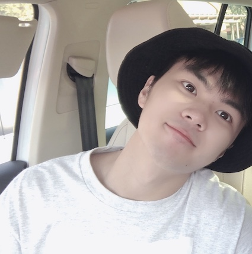

# Kangming Yu's User Page

[To README File](README.md)

## Personal introduction

**I am _Kangming Yu_, a student majoring in _Computer Science_ at UCSD.** Because of ~~COVID-19~~, I was suffered from the effects of taking classes in China. However, as a computer major student, staying up late is a normal thing. Fortunately, I can go back to the campus to have classes this quarter.

During my internship in the summer vacation, I joined a startup company and developed a ***WeChat mini program*** about smart community with my teammates. The development language of the WeChat mini program is very similar to that of the web.

In addition, I would like to say that I also very much hope to set up my own Internet company. I hope to establish a *psychological counseling and treatment platform* in the future, and make remote psychological therapy more mature and common through improved VR technology. I feel that combining VR technology with psychological therapy would make for a different user experience.

I love soccer very much. My favorite club is **Barcelona**. My favorite player is **Messi**. By the way, Messi just won the Copa America!

I hope people with similar interests can [contact me](https://github.com/Kelvin1003/GitHub-Pages/blob/create-index-md-file/index.md#contact-me)


<br>

## Technical Skills
- Languages: C, C++, Java, Python, Assembly, Haskell, R, SystemVerilog
- Databases: MySQL, Redis
- Others: Linux, Git, Docker

```
cout << "Hello World!";
```


<br> 

## Work Experience
> JAVA DEVELOPMENT ENGINEER INTERN
- Focused Photonics Inc. June 2020 - August 2020


> WEB DEVELOPMENT ENGINEER INTERN
- Gonghetang Tea Tourism Investment and Development Ltd. June 2019 - August 2019


> SOFTWARE ENGINEER INTERN
- Zhejiang Ruiyang Technology Limited Company June 2018 - August 2018


<br>

## Academic Background
> [UC SAN DIEGO](https://ucsd.edu/) | Computer Science (BS) September 2020 - Present
- Current GPA: 4.0
- Term Honors (Spring 2021 & Winter 2021): Provost Honors

<br> 


## Target Course
- [x] CSE 100 | Advanced Data Structures
- [x] CSE 101 | Design and Analysis of Algorithms
- [ ] CSE 110 | Software Engineering


<br>

## Contact Me
1. Email: kay003@ucsd.edu
2. Address: 9500 GILMAN DR, LA JOLLA, CA

